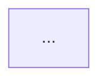

# Agent Conventions

This file specifies the format and conventions for all documentation and code in this repository.

## Directory Structure

```
concepts/
├── async/                    # AsyncIO fundamentals
├── agents/
│   ├── basics/               # Basic agent creation
│   ├── tools/                # Agents using tools (shell, function)
│   ├── guardrails/           # Input/output guardrails
│   ├── delegation/           # Handoffs, fan-out, agents-as-tools
│   └── orchestration/        # Supervisor / orchestrator patterns
└── applications/
    └── gradio-chatbot/       # Full Gradio chatbot app
```

Each leaf folder contains:
- `__init__.py` (empty)
- One or more `.py` scripts
- `README.md` documenting the topic

## Code Conventions

### Type Hints
All functions must use full type hints.

```python
def run(prompt: str, model: str) -> str: ...
```

### Docstrings
Google-style docstrings.

```python
def example(arg1: str, arg2: int = 0) -> bool:
    """Short description.

    Args:
        arg1: Description of arg1.
        arg2: Description of arg2.

    Returns:
        Whether the operation succeeded.

    Raises:
        ValueError: If arg1 is empty.
    """
```

### Imports
Order: stdlib → third-party → local, separated by a blank line.

```python
import asyncio
import os

from agents import Agent, Runner
from dotenv import load_dotenv

from .helpers import format_output
```

### Line Length
100 characters max.

### Main Guard
All runnable scripts must use:

```python
if __name__ == "__main__":
    asyncio.run(main())
```

### __init__.py
One per leaf folder, empty.

### Async Entry Point
All async code uses `asyncio.run(main())` as the entry point.

### API Keys
Never hardcoded. Always via `os.getenv("KEY_NAME")` with a clear error message if missing.

```python
api_key = os.getenv("OPENAI_API_KEY")
if not api_key:
    raise ValueError("OPENAI_API_KEY environment variable not set")
```

## Documentation Conventions

Each topic `README.md` follows this template:

```markdown
# Topic Name

## Overview
One paragraph describing the concept.

## Key Concepts
Bullet list of things the code demonstrates.

## How It Works

### Flow


### Execution
```mermaid
sequenceDiagram
  ...
```

## Code Walkthrough
Explanation of each script in execution order.

## Expected Output
Sample output blocks.

## Takeaways
Lessons learned.
```

## Mermaid Conventions

### Diagram Types
- `flowchart TD` — architecture, component relationships, delegation flows
- `sequenceDiagram` — step-by-step execution, message passing, tool calls

### Color Palette

| Role | Color | Hex |
|---|---|---|
| User / Input | Cyan | `#B4F9F8` |
| Agent / LLM | Lavender | `#BB9AF7` |
| Success / Output | Green | `#9ECE6A` |
| Error / Warning / Guardrail | Red | `#F7768E` |

Every diagram must define these classes at the top:

```mermaid
flowchart TD
    classDef user fill:#B4F9F8,stroke:#333,color:#333
    classDef agent fill:#BB9AF7,stroke:#333,color:#333
    classDef success fill:#9ECE6A,stroke:#333,color:#333
    classDef error fill:#F7768E,stroke:#333,color:#333
```
