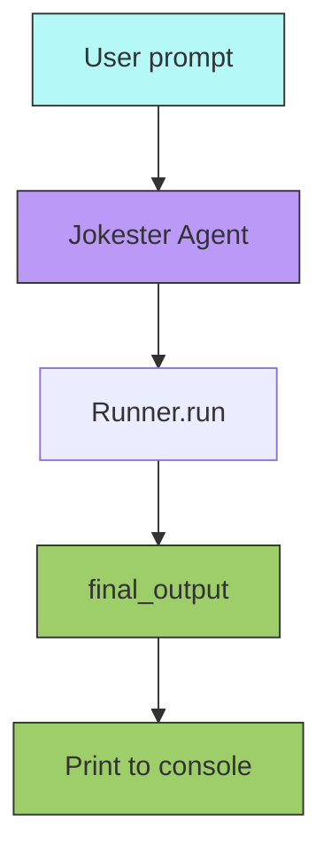
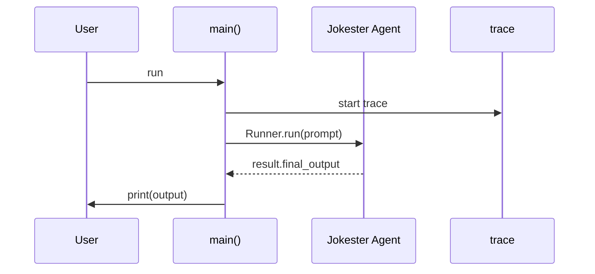

# Agent Basics

## Overview

Introduces the simplest building block of the OpenAI Agents SDK: creating an `Agent` with a name, instructions, and model, then running it with `Runner.run()`.

## Key Concepts

- Agent instantiation with `Agent(name, instructions, model)`
- Running an agent via `Runner.run(agent, prompt)`
- Tracing execution with `trace()`
- Loading API keys from environment variables

## How It Works

### Flow



### Execution



## Code Walkthrough

`joke_agent.py` is a minimal agent script:

1. **`load_dotenv(override=True)`** — Loads `.env` file for API keys.
2. **`api_key` check** — Raises `ValueError` if `OPENAI_API_KEY` is missing.
3. **`Agent(name="Jokester", ...)`** — Creates an agent with a simple instruction.
4. **`trace("Telling a joke")`** — Wraps execution in a named trace for observability.
5. **`Runner.run(agent, prompt)`** — Sends the prompt to the agent and waits for the response.
6. **`print(result.final_output)`** — Outputs the agent's response.

## Expected Output

```
Why did the autonomous AI agent break up with its partner?

It needed more space... to compute!
```

*(Actual joke varies per run.)*

## Takeaways

- An `Agent` is the atomic unit — name, instructions, model.
- `Runner.run()` is the standard way to execute an agent.
- `trace()` provides execution observability.
- Always validate API keys at startup with a clear error message.
