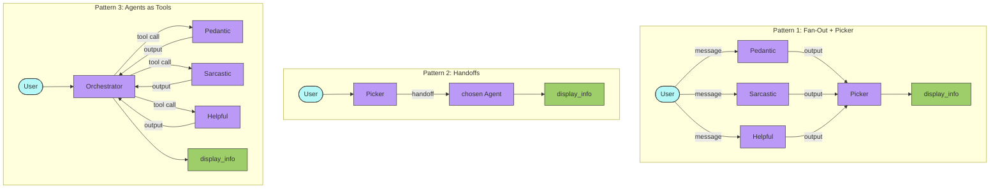
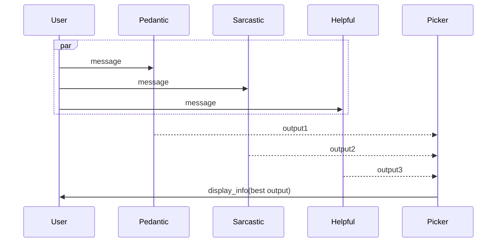
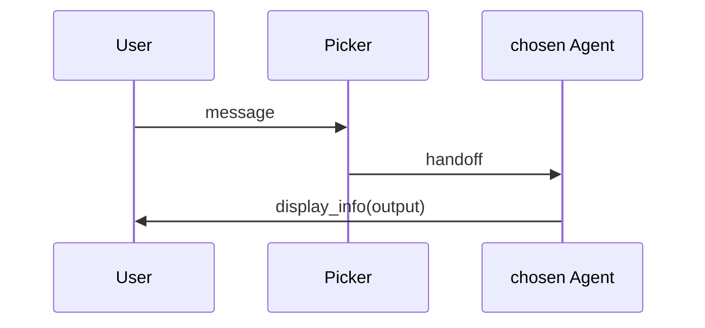
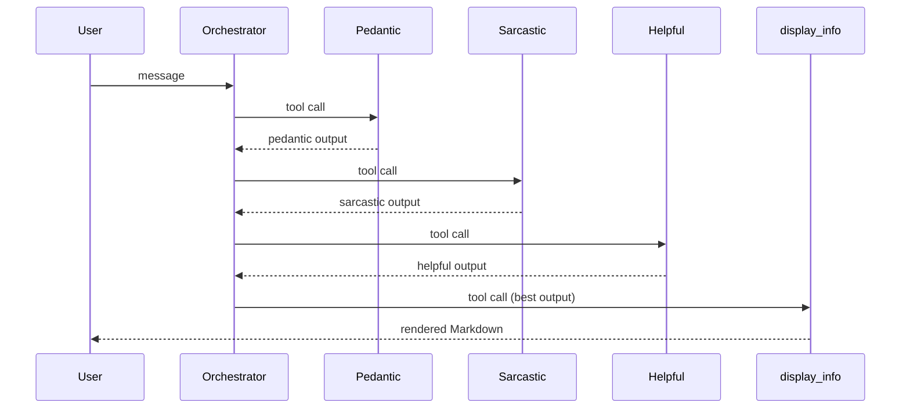

# Agent Delegation Patterns

## Overview

Compares three ways to coordinate multiple specialist agents in the OpenAI Agents SDK, using security expert personas analyzing Python packages. Each pattern trades off cost, control, and decision quality differently.

## Key Concepts

- **Fan-out + Picker** — Parallel execution of all experts, picker judges outputs
- **Handoffs** — Router delegates to one specialist and hands off control
- **Agents as Tools** — Subagents wrapped as callable tools; orchestrator stays in control
- Trade-offs between LLM call count, output visibility, and control granularity

## How It Works

### Flow — All Three Patterns

### Execution — Pattern 1: Fan-Out + Picker

> **Always 4 LLM calls.** Picker sees all outputs. Most expensive, most informed.

### Execution — Pattern 2: Handoffs

> **2 LLM calls.** Cheapest. Picker decides without seeing any output. Each subagent needs `display_info` in its own `tools=[]`.

### Execution — Pattern 3: Agents as Tools

> **1–4 LLM calls, dynamic.** Orchestrator stays in control. Subagents only receive the input string, not full history.

## Code Walkthrough

### `fan_out_picker.py`

1. `create_experts()` — Creates 3 expert agents (pedantic, sarcastic, helpful) and a picker agent.
2. `main()` — Runs all 3 experts simultaneously via `asyncio.gather`, collects outputs, feeds them to the picker.

### `handoffs.py`

1. Each expert is registered as a `handoffs=[...]` target on the picker with a `handoff_description`.
2. Each expert has `display_info` in its `tools` list so it can output directly after taking control.
3. The picker routes to one expert and hands off full control.

### `agents_as_tools.py`

1. Each expert is wrapped with `.as_tool(tool_name=..., tool_description=...)`.
2. All tool-wrapped agents and `display_info` go into the orchestrator's `tools=[...]`.
3. The orchestrator stays in control and can call any subset of experts dynamically.

## Comparison

| Pattern | LLM Calls | Picker Sees Output? | Control Model |
|---|---|---|---|
| Fan-out + Picker | 4 (always) | Yes, all outputs | Picker judges after |
| Handoffs | 2 (always) | No, none | Subagent takes over |
| Agents as Tools | 1–4 (dynamic) | Yes, each result | Orchestrator throughout |

## Takeaways

- **Fan-out + Picker** is best when you need to compare multiple expert opinions and cost is not a concern.
- **Handoffs** are ideal for efficient routing when you trust the picker's intent-based decision.
- **Agents as Tools** gives maximum control and flexibility at the cost of more LLM calls if all experts are invoked.
