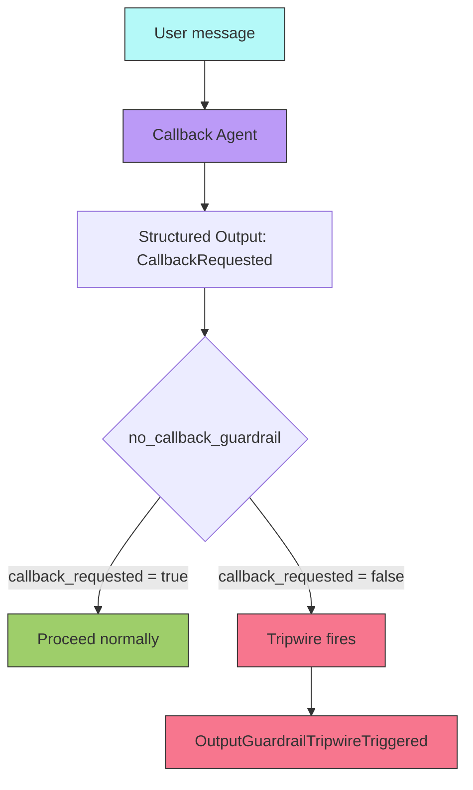
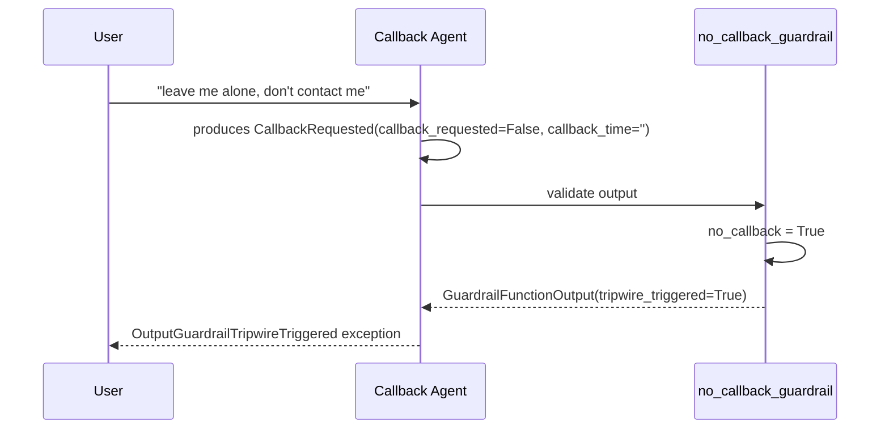

# Guardrails

## Overview

Demonstrates **output guardrails** in the OpenAI Agents SDK: a safety mechanism that validates an agent's structured output and can interrupt execution if a condition is met. In this example, the guardrail trips when a user does *not* want a callback — preventing the agent from proceeding with an unwanted action.

## Key Concepts

- Structured output with Pydantic `BaseModel`
- `@output_guardrail()` decorator — validates agent output after each turn
- `GuardrailFunctionOutput` — return type containing `tripwire_triggered` and `output_info`
- `OutputGuardrailTripwireTriggered` — exception raised when a tripwire fires

## How It Works

### Flow



### Execution



## Code Walkthrough

`output_guardrail_demo.py` contains:

1. **`CallbackRequested`** — A Pydantic model defining the structured output the agent must produce. Two fields: `callback_requested` (bool) and `callback_time` (str).
2. **`no_callback_guardrail`** — An async function decorated with `@output_guardrail()`. It receives the agent's structured output and checks if `callback_requested` is `False`. If so, it sets `tripwire_triggered=True`, causing the SDK to raise `OutputGuardrailTripwireTriggered`.
3. **`guardrail_agent`** — An agent configured with `output_type=CallbackRequested` and `output_guardrails=[no_callback_guardrail]`.
4. **`main()`** — Sends a message where the user explicitly declines a callback, triggering the guardrail. The try/except catches the tripwire exception.

## Expected Output

```
callback_requested=False callback_time=''
Guardrail tripped: Guardrail OutputGuardrail triggered tripwire
```

## Takeaways

- Output guardrails run after the agent produces output but before it's returned to the caller.
- `tripwire_triggered=True` causes an exception — use this to block undesired outputs.
- `output_type` with Pydantic models gives structured, type-safe agent outputs.
- Guardrails are a safety net — they catch what prompt instructions might miss.
