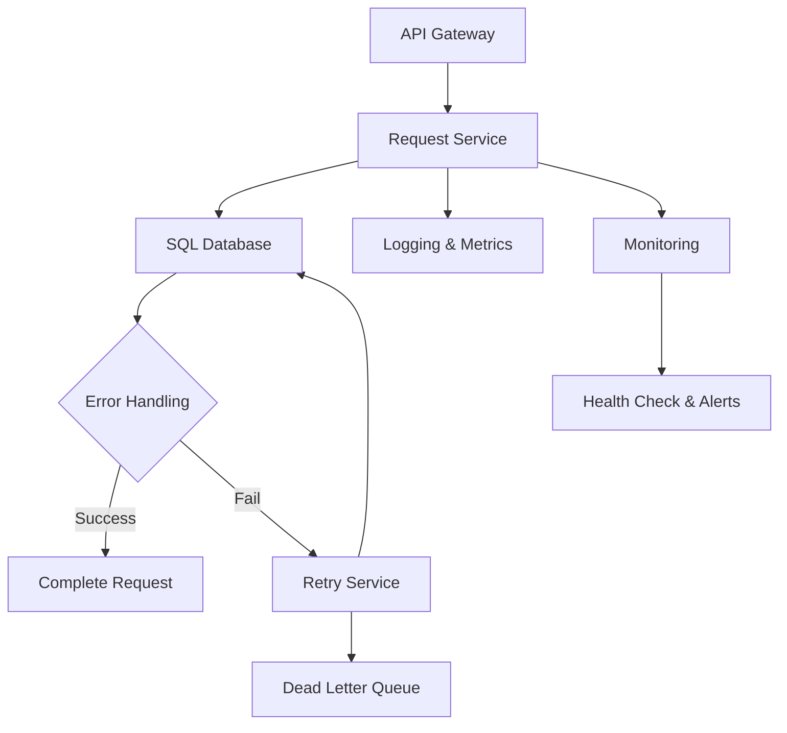
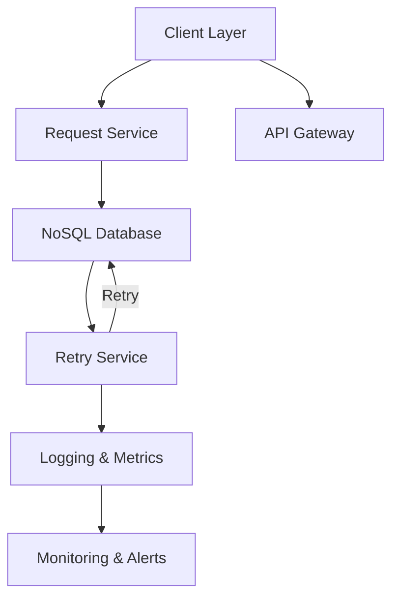
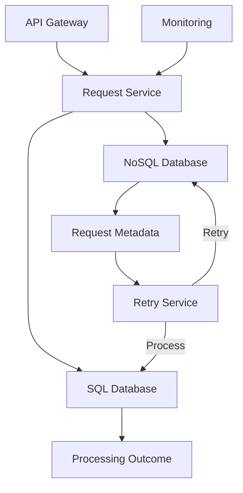

$ python supervisor.py

The orchestrator calls three architects, then hands off to the visualizer.

============================================================
# Architectural Designs: Request Storage for Retry on Failure

## 1. SQL-Based Recoverable Request Storage

**Key features:** Idempotency via payload hashing, backpressure with priority
queuing, circuit breaker resilience, `SKIP LOCKED` for concurrent batch processing.

## 2. NoSQL-Based Request Storage

**Key features:** Flexible schemas for varying request shapes, async event-driven
decoupling, scalable at the cost of transactional guarantees.

## 3. Hybrid Architecture

**Key features:** NoSQL for request metadata (flexible ingestion), SQL for
processing outcomes (strong consistency), best of both worlds.
============================================================
