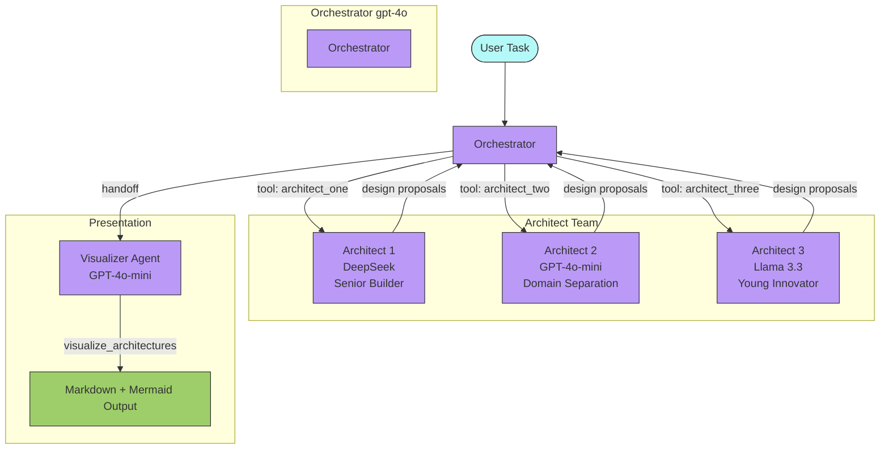
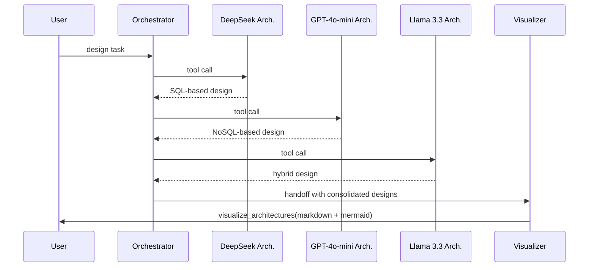

# Supervisor / Orchestrator Pattern

## Overview

Implements a **Supervisor multi-agent architecture** where a central orchestrator coordinates three architect agents (each using a different LLM model) to produce architectural designs, then hands off to a visualizer agent for final presentation. Demonstrates mixing **agents-as-tools** and **handoffs** in a single workflow.

## Key Concepts

- Multi-model agents: DeepSeek, GPT-4o-mini, and Llama 3.3 via Groq
- `OpenAIChatCompletionsModel` — wrapping any OpenAI-compatible API as an agent model
- Mixing `tools` (architects as callable tools) and `handoffs` (visualizer)
- Supervisor delegates to architects, collects results, hands off to visualizer

## How It Works

### Flow

### Execution

## Code Walkthrough

`supervisor.py` builds a multi-agent system across three layers:

1. **Model Setup** — Three `AsyncOpenAI` clients configured for DeepSeek, Groq, and OpenAI APIs. Each wrapped in `OpenAIChatCompletionsModel` to be used as an agent model.
2. **Architect Agents** — Three agents with distinct personas:
   - *Deep Seek Architect*: Senior builder, loves patterns and clean domain design
   - *Gemini Architect*: Domain separation advocate, immutability and layered architecture
   - *Groq Architect*: Young developer, embraces new patterns
   - All three wrapped as tools via `.as_tool()`
3. **Visualizer Agent** — Converts raw designs into formatted Markdown with Mermaid diagrams. Registered as a `handoff` target.
4. **Orchestrator** — The supervisor (gpt-4o). Calls each architect as a tool, consolidates results, then hands off to the visualizer.

## Agents Overview

| Agent | Model | Personality |
|---|---|---|
| Orchestrator | `gpt-4o` | Delegates, coordinates, hands off |
| Architect 1 | `deepseek-chat` | Senior builder, patterns, scalability |
| Architect 2 | `gpt-4o-mini` | Domain separation, immutability |
| Architect 3 | `llama-3.3-70b` | Young innovator, new approaches |
| Visualizer | `gpt-4o-mini` | Converts designs to markdown + mermaid |

## Expected Output

The visualizer produces architectural designs with mermaid diagrams. Example designs generated:

- **SQL-Based Recoverable Request Storage** — Idempotency via payload hashing, priority queuing, circuit breaker, `SKIP LOCKED` for concurrent processing
- **NoSQL-Based Request Storage** — Flexible schemas, async event-driven decoupling, lower transactional guarantees
- **Hybrid Architecture** — NoSQL for request metadata, SQL for processing outcomes, best of both worlds

## Takeaways

- `.as_tool()` gives the orchestrator fine-grained control over when sub-agents are called.
- Handoffs transfer full control — use them for the final presentation layer.
- `OpenAIChatCompletionsModel` lets you use any OpenAI-compatible API as an agent model.
- The supervisor pattern cleanly separates coordination (orchestrator), execution (architects), and presentation (visualizer).
