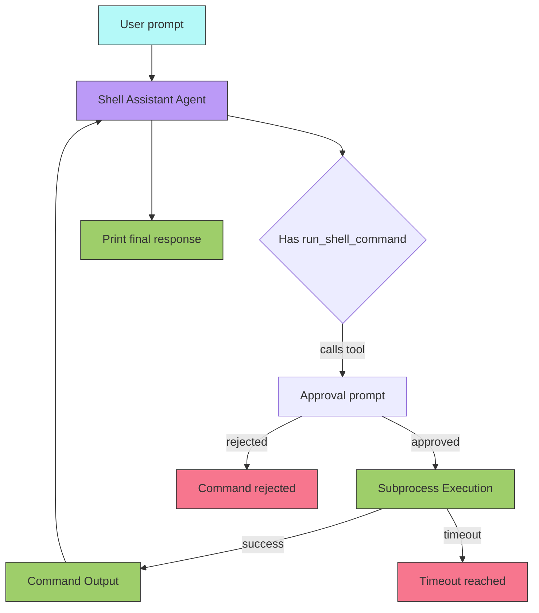
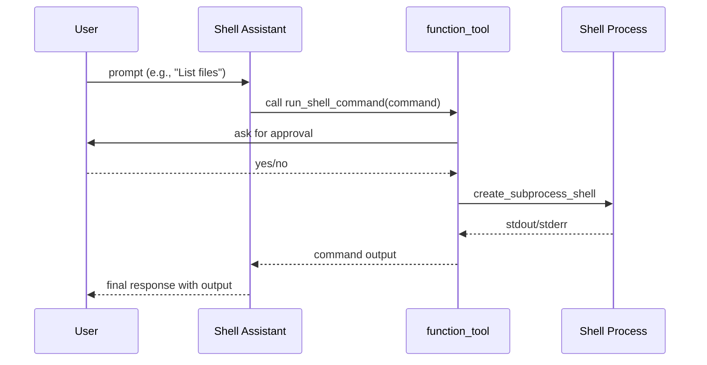

# Agents with Tools

## Overview

Demonstrates how to give an OpenAI SDK `Agent` access to tools — specifically a `@function_tool` that lets the agent execute shell commands on the host machine. Includes a human-in-the-loop approval mechanism. Uses `function_tool` instead of `ShellTool` for universal API compatibility with models like gpt-4o-mini.

## Key Concepts

- Wrapping external capabilities as tools (`@function_tool`)
- Human-in-the-loop shell command approval
- Async subprocess execution with timeout support
- `ModelSettings(tool_choice="required")` — forcing the agent to use a tool
- Interactive CLI prompt loop

## How It Works

### Flow



### Execution



## Code Walkthrough

`shell_agent.py` has four main components:

1. **`run_shell_command`** — A `@function_tool` decorated async function that executes shell commands via `asyncio.create_subprocess_shell`. Prompts for user approval before execution and supports 30-second timeout.
2. **`prompt_shell_approval`** — Interactive CLI prompt that asks the user yes/no before any shell command runs. Respects `SHELL_AUTO_APPROVE=1` env var for automation.
3. **`main(prompt, model)`** — Creates the agent with `run_shell_command` as a tool, forces tool usage via `tool_choice="required"`, and runs the prompt.
4. **`ask_user_for_shell_prompt`** — Interactive loop that continuously asks for prompts until the user types "exit".

## Expected Output

```
Enter a prompt for the agent (or 'exit' to quit):
> List the files in the current directory
[info] Using model: gpt-4o-mini
Shell command approval required:
  ls
Proceed? [y/N] y

Final response:
The current directory contains:
- README.md
- shell_agent.py
- example_output.txt
```

## Takeaways

- `@function_tool` works with Chat Completions API and all models (unlike `ShellTool` which requires the Responses API and specific model support).
- Human-in-the-loop approval is baked directly into the tool function — no need for `on_approval` callbacks.
- `tool_choice="required"` forces the agent to use a tool on every turn, useful for ensuring the shell is always invoked.
- `asyncio.create_subprocess_shell` with `wait_for` provides timeout-safe shell execution.
