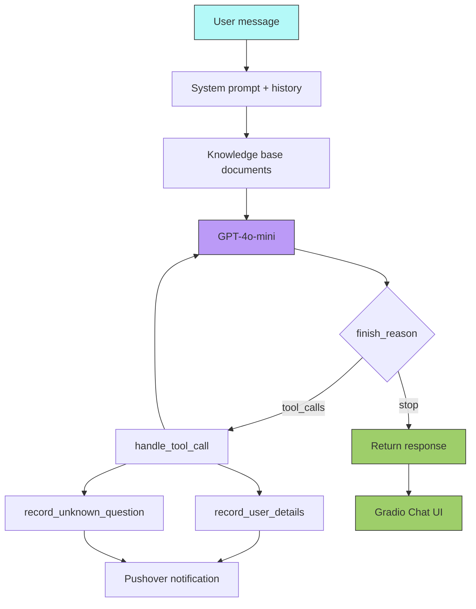
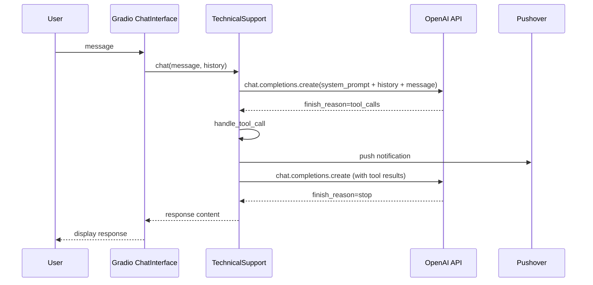

# Gradio Technical Support Chatbot

## Overview

A full-stack technical support chatbot built with Gradio and GPT-4o-mini. Loads a knowledge base from local documents and provides two function-calling tools: one to record user contact details and one to log unanswerable questions, both with Pushover notifications.

## Key Concepts

- Gradio `ChatInterface` for a web chat UI
- OpenAI function-calling tools defined as JSON schemas
- Tool call loop: detect `tool_calls` finish reason, execute tools, continue
- Knowledge base loading from PDF, TXT, MD, JSON, YAML, XML, CSV files
- Pushover integration for notifications
- Manual tool call handling (not using the Agents SDK)

## How It Works

### Flow

### Execution

## Code Walkthrough

`app.py` has two main parts:

1. **Tool definitions** — Two JSON schemas (`record_user_details_json`, `record_unknown_question_json`) wrapped in OpenAI's function-calling format. Corresponding Python functions call Pushover for notifications.
2. **`TechnicalSupport` class**:
   - `__init__` — Initializes the OpenAI client and loads the knowledge base.
   - `load_documents` — Scans the `documents/` folder for PDF, TXT, MD, RST, JSON, YAML, XML, CSV files and concatenates them.
   - `system_prompt` — Builds the system prompt with role instructions and the knowledge base content.
   - `handle_tool_call` — Parses tool call arguments, executes the corresponding Python function, and returns results.
   - `chat(message, history)` — The Gradio-compatible handler. Runs a loop: sends messages to OpenAI, detects `tool_calls`, executes tools, repeats until `stop`.

## Setup

1. Create a `documents/` folder next to `app.py` with your technical documentation.
2. Set environment variables: `OPENAI_API_KEY`, `PUSHOVER_TOKEN`, `PUSHOVER_USER`.
3. Run `python app.py` — Gradio launches a local web server.

## Expected Output

A Gradio web interface opens. The chatbot answers questions based on the loaded documents, records user emails when offered, and logs questions it cannot answer.

## Takeaways

- The manual tool-call loop (check `finish_reason`, execute, append, repeat) gives full control over tool execution.
- JSON-schema tool definitions are the standard OpenAI format — the Agents SDK abstracts this away.
- Loading a local knowledge base into the system prompt is an easy form of RAG (retrieval-augmented generation).
- Pushover provides lightweight notifications without needing SMS or email infrastructure.
