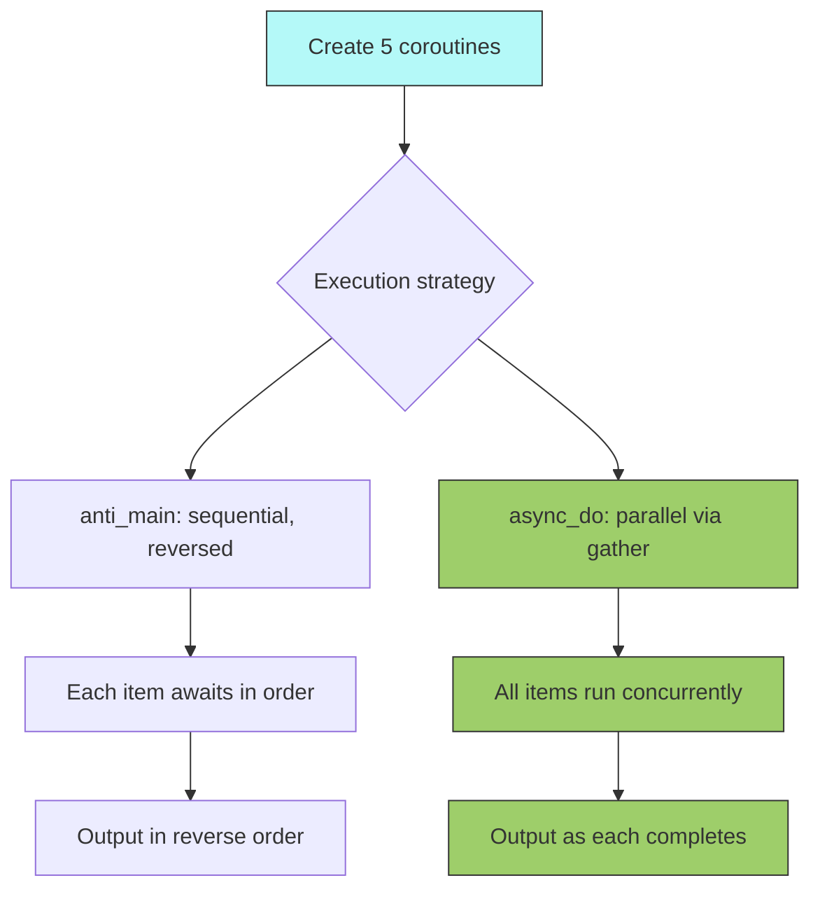
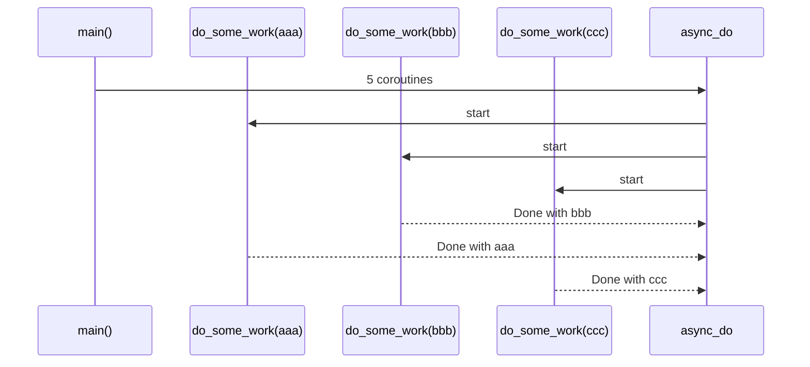

# AsyncIO Fundamentals

## Overview

Demonstrates Python's `asyncio` library for concurrent execution. Shows the difference between sequential and parallel async execution, and the pitfall of using blocking calls inside async functions.

## Key Concepts

- Creating `async` functions that return coroutines
- Sequential execution via `await` in a loop
- Parallel execution via `asyncio.gather`
- The bug: blocking calls (`time.sleep`) stall the event loop

## How It Works

### Flow



### Execution



## Code Walkthrough

`asyncio_demo.py` contains three key functions:

1. **`do_some_work(identifier)`** — Simulates async work with a random sleep. Returns a completion string.
2. **`main()`** — Creates 5 coroutines but does not execute them; returns them as a list.
3. **`anti_main(itms)`** — Awaits items in reverse order, demonstrating sequential execution. Each item must complete before the next starts.
4. **`async_do(itms)`** — Uses `asyncio.gather` to run all items concurrently. Total time = max(runtime of any single item).

## Expected Output

```
Python Version: 3.13.x

do_some_work for bbb
do_some_work for aaa
do_some_work for ddd
do_some_work for ccc
do_some_work for eee
Finished work for Done with bbb
Finished work for Done with aaa
Finished work for Done with ddd
Finished work for Done with ccc
Finished work for Done with eee
```

Order of completion varies due to random sleep durations.

## Takeaways

- `asyncio.gather` enables true concurrency — total runtime equals the slowest task, not the sum.
- Blocking calls inside `async` functions defeat the purpose of asyncio.
- Coroutines are lazy — they don't execute until awaited.
